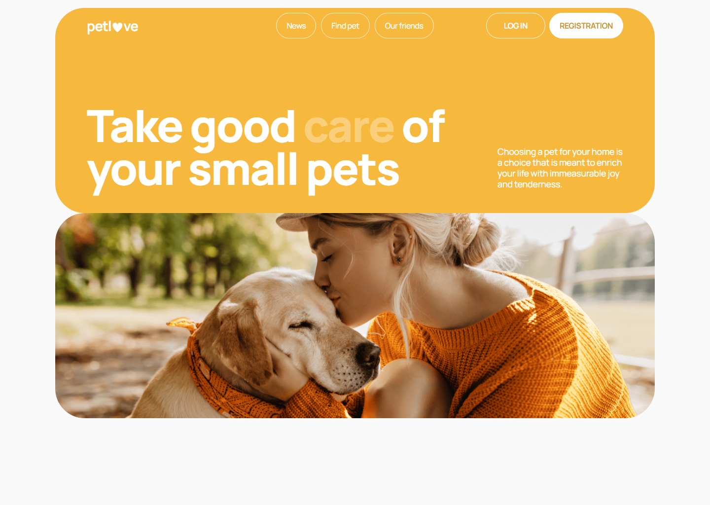
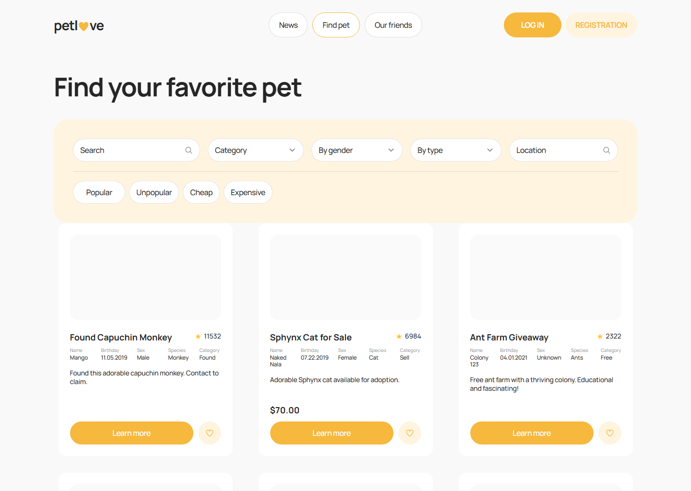
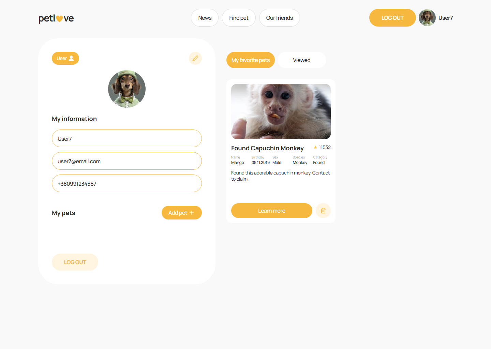
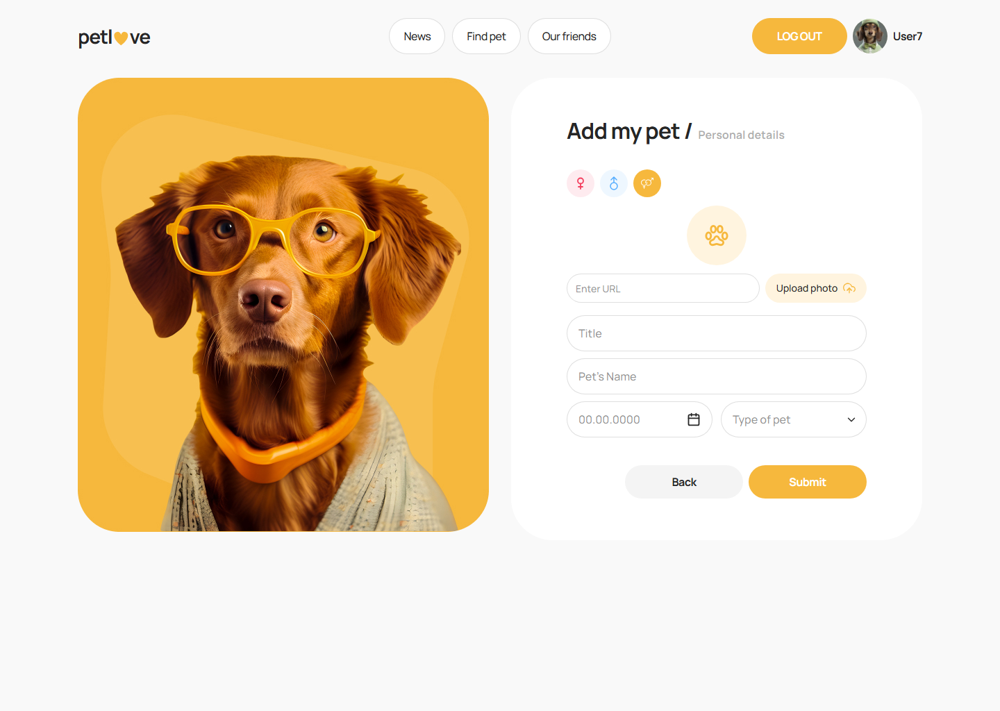
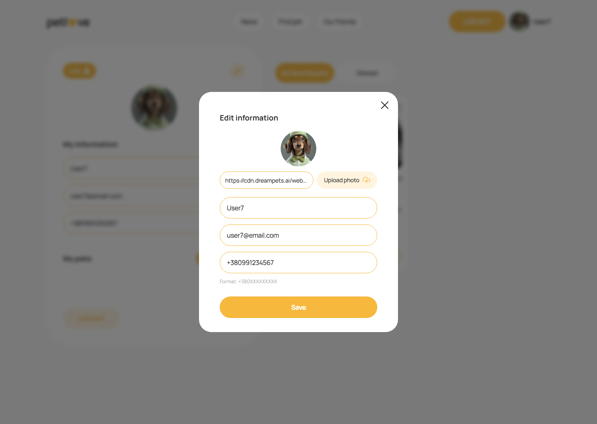
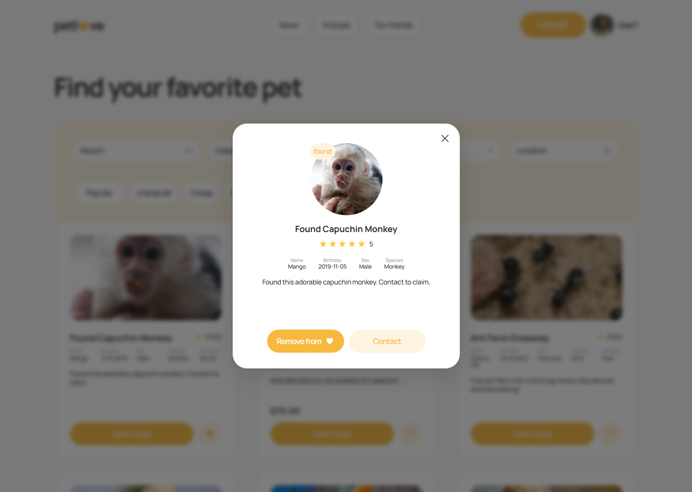

# Petlove

Petlove is a responsive pet services application where users can discover notices, manage favorites/viewed items, and maintain a personal pet profile.

Built as a production-style frontend with authentication, URL-driven filtering, reusable modals, and a consistent design system.

## Project Overview

### What Petlove does

- Browses pet notices with rich filters and sorting.
- Supports authenticated user flows: login/register/logout and profile management.
- Lets users add pets, edit profile data, and track favorite/viewed notices.

### Key Features

- Auth persistence across refresh (`refreshUser` bootstrap flow).
- Notices page with filter panel:
  - search (debounced),
  - category / gender / species dropdowns,
  - location async search,
  - sort pills,
  - Reset action.
- Profile page with:
  - My pets list,
  - Favorites tab,
  - Viewed tab,
  - Edit Profile modal (including phone UX validation and avatar URL support).
- Add Pet flow with first-pet congratulation modal.
- Notice "Learn more" modal with dynamic favorite action and contact CTA.
- Mobile / tablet / desktop responsive behavior aligned to design breakpoints.

### Tech Stack

- `React 19` + `TypeScript`
- `Vite`
- `Redux Toolkit` + `react-redux`
- `React Router`
- `Axios`
- `react-hook-form` + `yup`
- `react-select`
- `react-toastify`
- Styling: `CSS Modules` + global design tokens (`src/styles/variables.css`)

## Screenshots

Screenshots are included in the `screenshots/` folder.

- Home page  
  
- Notices page with filters  
  
- Profile page (My pets, Favorites, Viewed)  
  
- Add Pet page  
  
- Edit Profile modal  
  
- Notices Learn More modal  
  

## Live Demo

- Public deployment: [https://petlove-project-one.vercel.app](https://petlove-project-one.vercel.app)
- Local demo: follow the Quick Start section below

## Quick Start

### 1) Install dependencies

```bash
npm install
```

### 2) Run development server

```bash
npm run dev
```

### 3) Build and lint

```bash
npm run build
npm run lint
```

### Backend/API setup

No local backend is required for basic frontend demo.  
The app currently uses a hosted API base URL in `src/api/axiosInstance.ts`.

### Test account (for demo)

- Email: `user7@email.com`
- Password: `12341234`

## Deployment (Vercel)

Minimal deployment config is included in `vercel.json` for SPA route rewrites.

### Deploy steps

1. Push this repository to GitHub.
2. In Vercel, click **New Project** and import the repo.
3. Keep defaults (Vite is auto-detected):
   - Build command: `npm run build`
   - Output directory: `dist`
4. Deploy.

### Why `vercel.json` is included

React Router uses client-side routes (`/profile`, `/notices`, etc.), so direct refresh on nested paths needs rewrite fallback to `index.html`.

## Key Features Implemented

- Auth session restoration on app bootstrap.
- Add Pet flow with first-pet modal UX.
- Profile edit with modal-based form and avatar URL support.
- Favorites / Viewed synchronization across Notices and Profile.
- NoticesFilters with search, dropdowns, sort pills, and Reset.
- Responsive implementation for:
  - Mobile: `375px+`
  - Tablet: `768px+`
  - Desktop: `1280px+`

## File Structure

```text
petlove/
  public/
  screenshots/
  src/
    api/
    components/
    hooks/
    pages/
      AddPetPage/
      FriendsPage/
      HomePage/
      LoginPage/
      MainPage/
      NewsPage/
      NoticesPage/
      NotFoundPage/
      ProfilePage/
      RegisterPage/
    routes/
    store/
    styles/
      variables.css
      global.css
      reset.css
    types/
    utils/
    App.tsx
    main.tsx
  package.json
  README.md
```

## Design System

- Breakpoints:
  - `375px` mobile
  - `768px` tablet
  - `1280px` desktop
- Tokens:
  - colors, spacing, typography, radii, shadows, z-index, motion
  - defined in `src/styles/variables.css`
- Styling approach:
  - global token primitives + component-scoped CSS Modules

## Portfolio Notes

Petlove demonstrates practical frontend engineering across:

- state-heavy UI flows (filters, favorites, viewed history),
- accessible modal interactions,
- URL-synced search/filter state,
- responsive design implementation from Figma,
- maintainable folder-based page architecture.

## Demo Script (60-120 sec)

Use this short flow for portfolio demo recording:

1. Open **Home** and briefly show responsive hero/UI polish.
2. Go to **Notices**:
   - type in Search,
   - use filter dropdowns,
   - choose sort pills,
   - click **Reset**.
3. Open **Learn more** modal and highlight details + favorite action.
4. Log in with demo account (`user7@email.com` / `12341234`).
5. Go to **Profile** and show:
   - My pets,
   - Favorites and Viewed tabs,
   - Edit Profile modal.
6. Open **Add Pet** page and show form + first-pet UX flow.
7. Return to Notices/Profile and show favorites/viewed synchronization.
